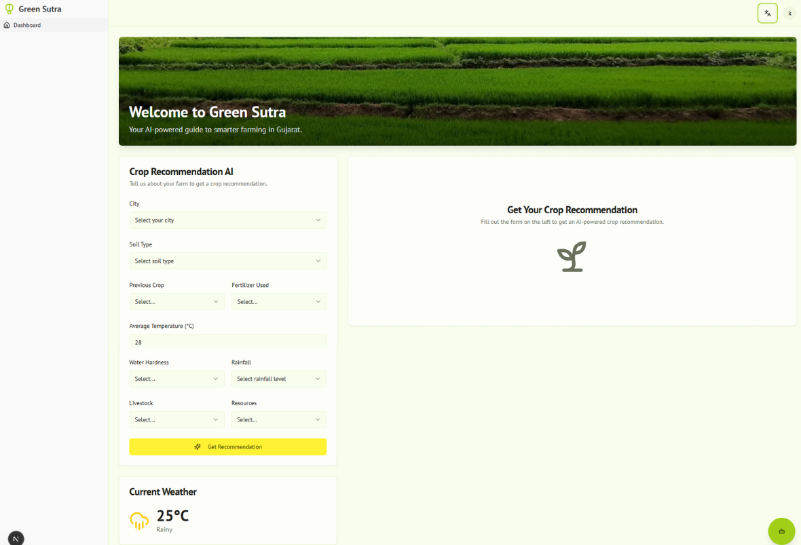
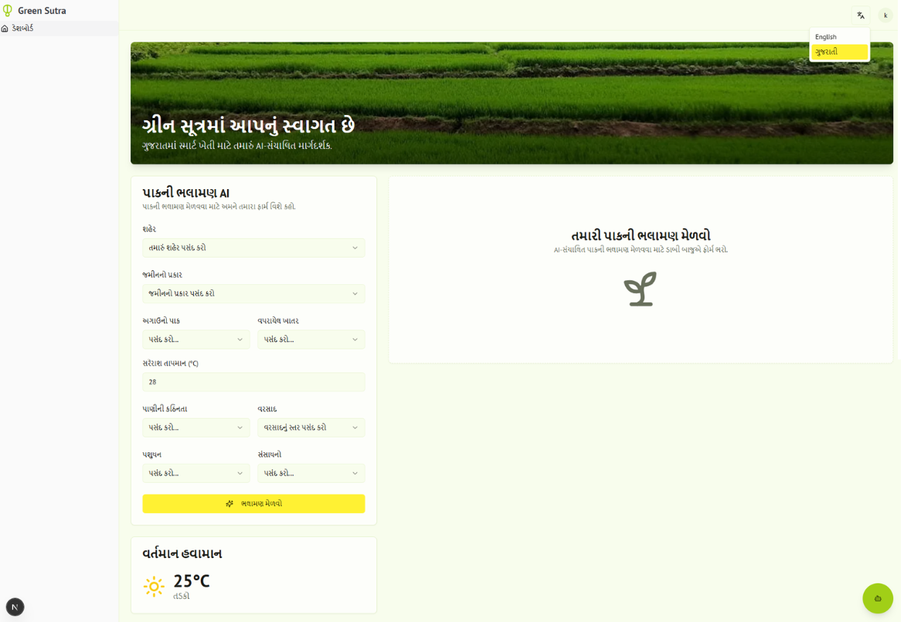

# Green_Sutra

## Overview

Green Sutra is an academic group project created to support small Indian farmers in making informed farming decisions.  
The system provides crop suggestions, crop rotation guidance, and farming advice using farm conditions such as soil type, location, and previous crop details. It also includes a bilingual assistant to help farmers interact with the system in English and Gujarati.

The project was developed as a second-last semester academic project and also served as a prototype submission for a Google hackathon.

---

## Green_Sutra_NLP
Designed a Bilingual system that can advise farmers for next crop, and crop rotation planning with live weather forecasting using location, soil type, previous crop as we as water hardness and Fertilizer used.  
Natural Language Processing is invloved in chatbot that assit in filling the form with both languges (**Engling and Gujrati**). Form is also Translated in English and Gurati using NLP Machine Translation.

---

## Goal and Purpose

Many small farmers lack timely guidance when choosing crops or managing resources. Traditional decisions often ignore soil condition, crop history, or changing environmental factors.

Green Sutra aims to:

- assist farmers in selecting suitable crops
- suggest crop rotation planning
- provide basic disease and resource guidance
- allow interaction through natural language in regional language support
- present farming advice in a simple web interface

---

## What Has Been Done

- Built a web application interface for farmer interaction
- Implemented crop recommendation workflow
- Added bilingual chatbot assistance (English and Gujarati)
- Integrated crop rotation suggestions into recommendations
- Provided disease risk and farming guidance tips
- Implemented secure user login using Firebase Authentication
- Stored user account data using Cloud Firestore
- Connected AI responses through Genkit flows
- Structured AI outputs using schema validation

---

## How the System Works (Simple Flow)

1. User fills the farming form through the web interface.
2. Inputs are validated on the client side.
3. Data is sent to server actions in Next.js.
4. Server triggers a Genkit AI flow.
5. Google Gemini-1.5-flash processes the request.
6. Structured recommendations are returned.
7. Results are displayed to the user dashboard.

---

## Models Used

### Current Model (Final Version)

- **Google Gemini-1.5-flash**
- Accessed through the **Genkit framework**
- Used for:
  - crop recommendation reasoning
  - chatbot interaction
  - bilingual assistance

### Previous Model (Initial Prototype)

- **Random Forest (scikit-learn)**
- Trained on agricultural datasets during early development
- Used for crop prediction experiments
- Produced limited accuracy, which led to migration towards AI-assisted reasoning using Gemini

---

## Technology Stack

### Frontend
- Next.js 15 (App Router)
- React 18
- ShadCN UI
- Tailwind CSS
- Lucide React

### Backend
- Next.js Server Actions (TypeScript)

### AI / NLP
- Genkit Framework
- Google Gemini-1.5-flash

### Database and Authentication
- Firebase Authentication
- Cloud Firestore

### APIs
- None currently  
  (Weather data is mocked and translation is handled through AI with a local dictionary)

---

## Feature Implementation Status

| Feature | Status |
|--------|--------|
| Crop recommendation | Yes |
| Chatbot assistance | Yes |
| Multi-language support | Yes |
| Crop rotation suggestions | Yes (Integrated into AI recommendation) |
| Disease prediction | Yes |
| Resource or fertiliser suggestions | Yes |
| User login (Firebase Auth) | Yes |
| Data storage (Firestore) | Yes (User account data stored on signup) |

---

## Where It Is Used

- Academic project (second-last semester)
- Prototype prepared for a Google hackathon submission in Hack2Skills

---

## Project Links

Repository:  
https://github.com/KapX09/Green_Sutra_NLP.git

Output Screenshots:  
 

---

## What Was Learnt

- Understanding challenges farmers face when accessing technical guidance
- Integrating NLP chatbot interaction within a web application
- Connecting AI workflows to a frontend interface
- Structuring AI outputs for reliable application responses
- Dataset preparation and experimentation during Random Forest training
- Observing limitations of traditional ML accuracy in real agricultural data
- Managing authentication and user data using Firebase
- Designing bilingual interaction for accessibility

---

## What Will Be Improved

- Move development fully to local environments instead of generated setups
- Introduce live data integration through APIs
- Experiment with FastAPI or Flask services
- Train a custom English–Gujarati translation model
- Expand agricultural datasets for improved training
- Revisit model training with improved data quality

---

## Project Type

This project was developed as a **group project consisting of three members**.

---
